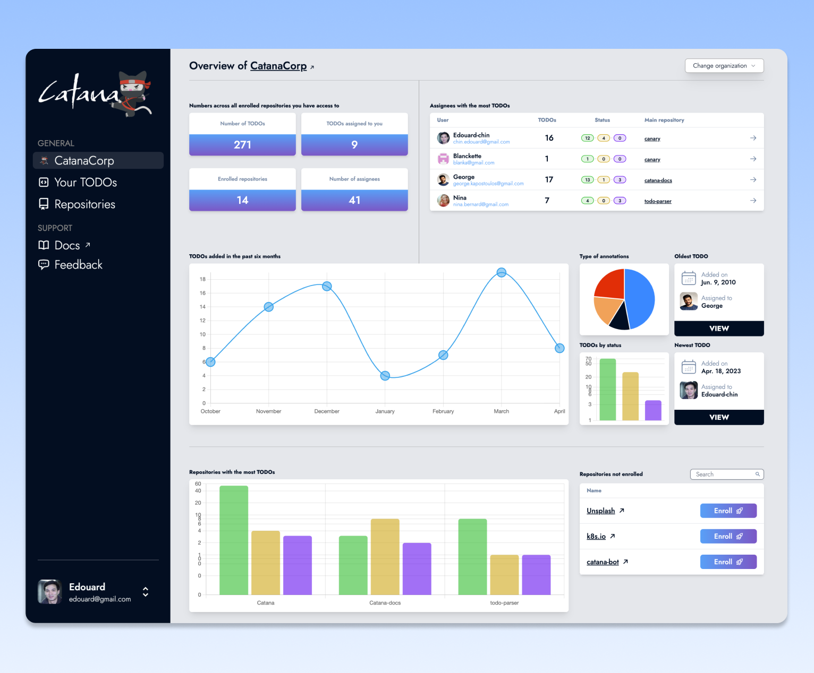
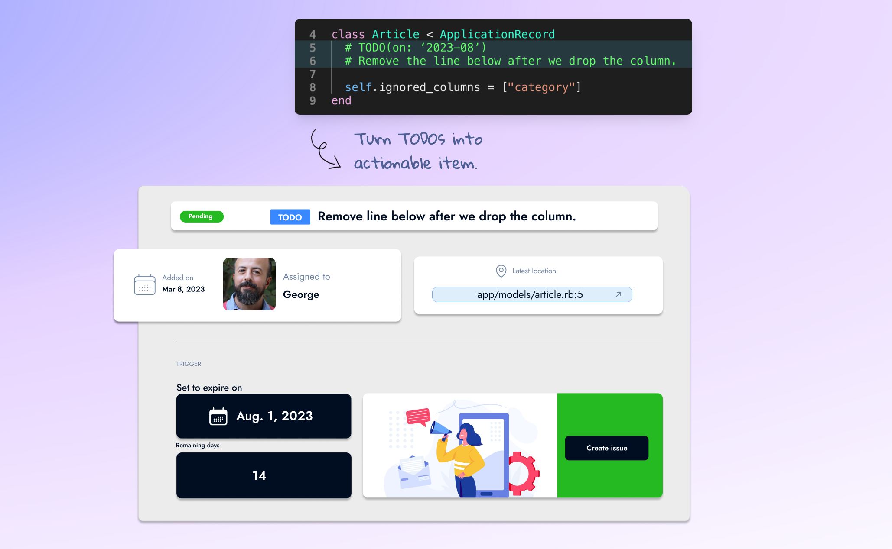

# Introduction

Catana is a tool to help **manage and prevent TODOs from turning into technical debt**.

It **enhances developers' annotations with a set of features and conventions**, all while helping project owners **maintain a comprehensive overview of the health of their codebases** across their organization.

Your projects deserve a better alternative than restricting or leaving TODOs growing out of control.

<figure><figcaption></figcaption></figure>

## <mark style="color:blue;">Leaving TODOs unmanaged</mark>

The accumulation of unresolved TODOs **contributes to the long-term maintenance overhead of your projects**. What originally was an innocent TODO could transform into a technical debt, slowing you down at best or even creating a security incident in the worst-case scenario.\
\
Without proper tooling, TODOs are hard to remember for developers, time-consuming to track down for team members, and nearly impossible to manage for project owners.

## <mark style="color:blue;">Restricting TODOs</mark>

In an attempt to tackle the inherent problems associated with writing TODOs, organizations may be tempted to resort to a drastic measure: **restrict TODOs with a linter** before they land on the release branch.

<figure><figcaption></figcaption></figure>

Because a TODO is often insufficiently specific to justify opening an issue, restricting its usage and inciting creating a ticket may **lead developers to take a mental note instead. A mental note is a recipe for catastrophe.**

In large projects with often hundreds of opened tickets, an issue tracker is already difficult to manage. Overloading it with “TODOs converted to issues” will bury them even deeper.

Major software organizations (Google, Cloudflare, Stripe, Shopify…) allow TODOs in their codebases for a reason:  A TODO and an issue tracker have **different uses, and solely using one over the other is not a solution.**

## <mark style="color:blue;">Introducing Catana</mark>

<figure><figcaption></figcaption></figure>

Catana was designed to solve the three inherent problems of TODOs:&#x20;

* Difficult to remember.
* Hard to find.
* Painful to manage.

Existing and upcoming TODOs on all your projects are recorded with detailed information in the background.

Each TODOs gets assigned ([automatically or manually](core-concepts/assigning-todos.md)) and Catana either **reminds its assignee** discreetly by [email or more loudly when a TODO is actionable](core-concepts/regular-and-expiring-todos.md).

TODOs on all projects across your organization are presented on a **dedicated and comprehensive dashboard**.\
Catana also offers multiple features to save developers’ time and automate tedious tasks.

\
