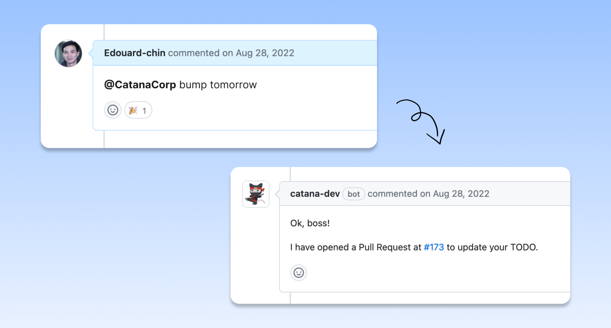

# Bump


The Bump command is used to edit and follow up on [expiring TODOs](../core-concepts/regular-and-expiring-todos.md#expiring-todos).


<figure><figcaption></figcaption></figure>

#### <mark style="color:blue;">When to use it</mark>

The bump command can be compared with the 'snooze' feature on an alarm clock. When it rings, you either wake up right away or snooze it to ring again later. Snoozing and sleeping a bit more is the norm.

<figure><figcaption></figcaption></figure>

Similarly, when a TODO expires, **it's completely acceptable to push it back to a later date** because you have other priorities.

Leaving an expired TODO untouched is a bad practice for two reasons:

1. It **confuses your team members** as to why a TODO expired but still remained in the codebase.
2. Even if there is a ticket open, it's **likely you'll forget about it** unless you get reminded again.

#### <mark style="color:blue;">Command</mark>

➡️  **`@catanacorp`**<mark style="color:purple;">**`bump`**</mark><mark style="color:orange;">**`[argument]`**</mark>

Catana will edit the TODO in the repository, open a Pull Request, and assign it to the user who invoked the command.&#x20;

Once the Pull Request is merged the Todo Item record in Catana's database will be [updated](../core-concepts/create-update-and-delete.md).

#### <mark style="color:blue;">Arguments</mark>

This command accepts arguments such as:

* `@catanacorp`<mark style="color:purple;">`bump`</mark><mark style="color:orange;">**`tomorrow`**</mark>
* `@catanacorp`<mark style="color:purple;">`bump`</mark><mark style="color:orange;">**`next week`**</mark>
* `@catanacorp`<mark style="color:purple;">`bump`</mark><mark style="color:orange;">**`next month`**</mark>
* `@catanacorp`<mark style="color:purple;">`bump`</mark><mark style="color:orange;">**`2023-06-18`**</mark>   (Where 2023-06-18 can be any date)

<figure><figcaption></figcaption></figure>
