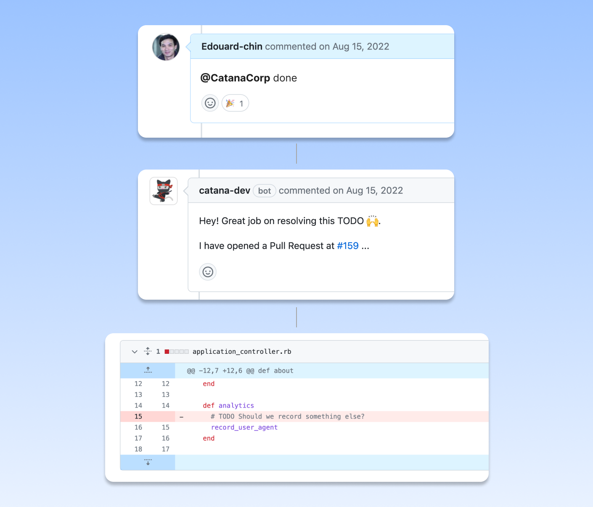

# Done


The Done command is used to remove a TODO from a codebase.


#### <mark style="color:blue;">When to use it</mark>

It's worth remembering that TODOs are often insufficiently specific when introduced and frequently considered irrelevant after some time.

The only action required is to remove them from your project, as they can be confusing and distracting to other team members who aren't aware of their irrelevancy.

#### <mark style="color:blue;">Command</mark>

➡️  **`@catanacorp`**<mark style="color:purple;">**`done`**</mark>

Catana will remove the TODO from the repository, open a Pull Request, and assign it to the user who invoked the command.

The Todo Item record will be destroyed from Catana's database once the [Pull Request is merged](../core-concepts/create-update-and-delete.md).

<figure><figcaption></figcaption></figure>

