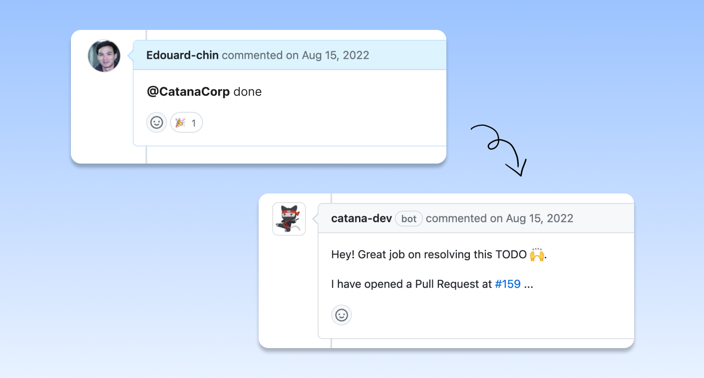

# Overview


Catana provides a feature to perform operations on TODOs by commenting on associated GitHub issues.


<figure><figcaption></figcaption></figure>

### <mark style="color:blue;">The pitfall of manually editing TODOs</mark>

A common pitfall when a user goes through its TODOs is to leave them untouched while they should either be removed or updated.

Having to go through a git dance and review process only to edit or remove a TODO is tedious, and **developers tend to take a mental note to follow up later** (aka never).

### <mark style="color:blue;">🤖 The perfect task for a bot</mark>

Simple changes like modifying or removing a TODO should be delegated to a bot. Catana's commands are a **convenient way to manage TODOs and save developers valuable time**.

When a user types a command, Catana will perform the requested operation and open a Pull Request for review. Developers only have to click on the "merge" button.

### <mark style="color:blue;">Usage</mark>

To perform a command, reply in a comment to a GitHub issue previously opened by Catana and **type `@catana-dev` followed by the command name**.\

