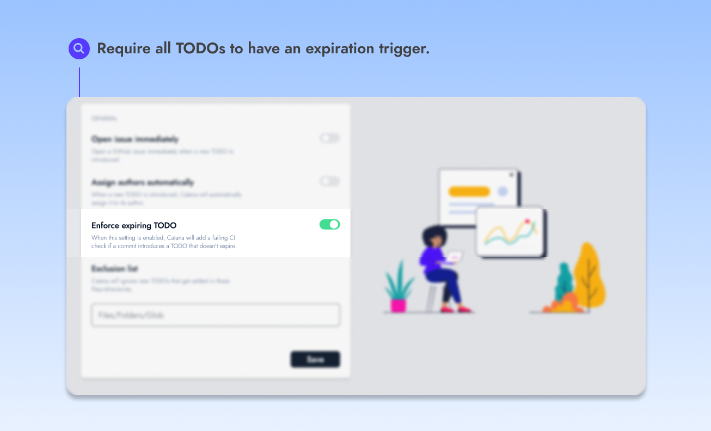
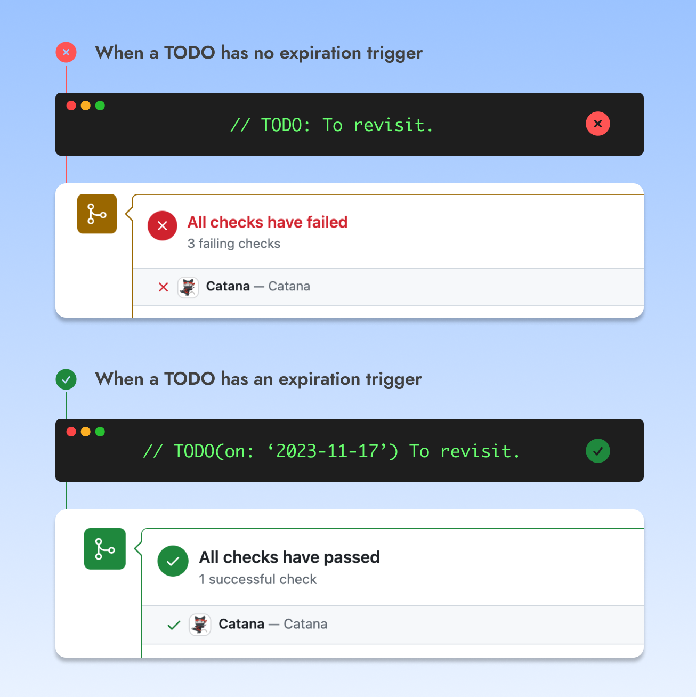

# Enforce expiring TODOs

<figure><figcaption></figcaption></figure>

When this option is enabled, **upcoming TODOs will be required to have an** [**expiration trigger**](broken-reference)**.**

Catana will add a failing CI check status on Pull Requests if a TODO without an expiration trigger is introduced.

<figure><figcaption></figcaption></figure>
