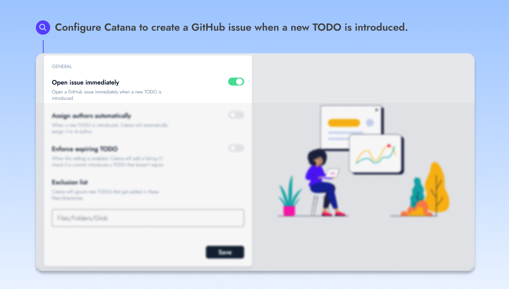

# Open GitHub issues


You can configure Catana to open a GitHub issue immediately when a new TODO is introduced.


<figure><figcaption></figcaption></figure>

By default, Catana creates a GitHub issue [when a TODO expires](../core-concepts/regular-and-expiring-todos.md#expiring-todos).\
You can however **enable the option to open a GitHub issue immediately** when a new TODO is introduced.

#### Reminders

When a TODO expires, Catana will notify its assignee by commenting on the opened issue.
