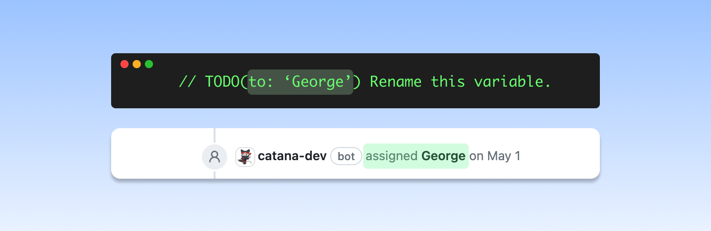
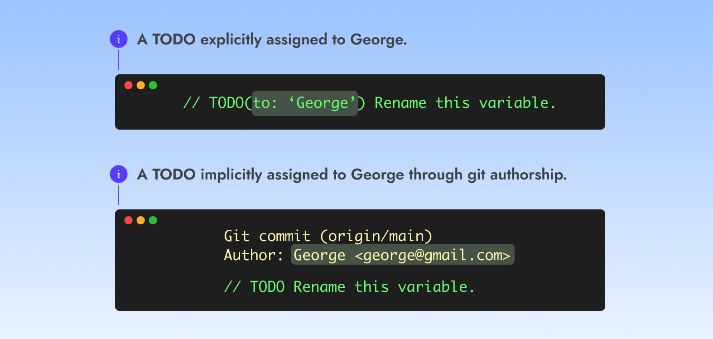
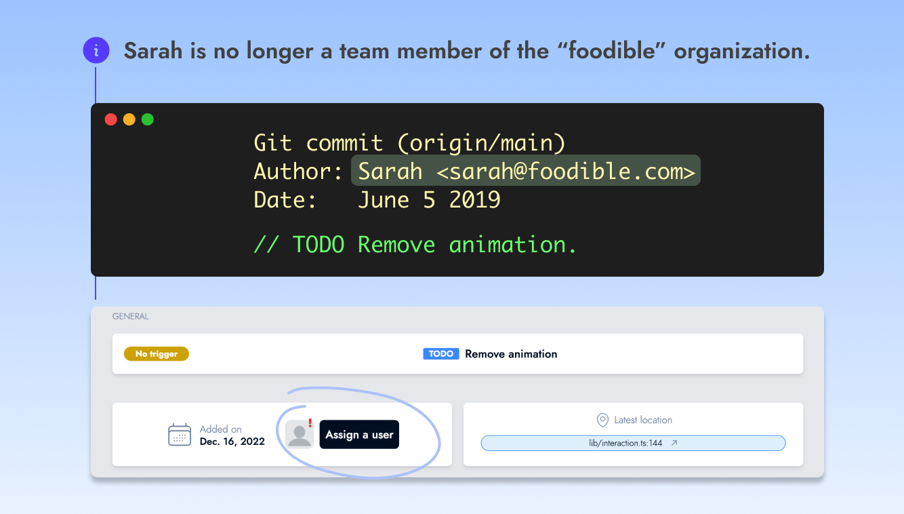
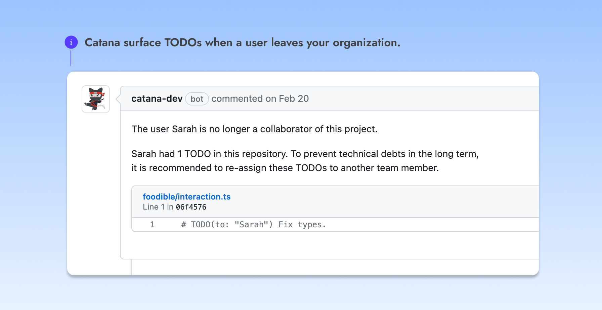

# Assigning TODOs

When a TODO is introduced, it's likely to remain unresolved for an extended period of time **because its author may forget to address it**. Additionally, when a TODO lacks clear ownership, it becomes the responsibility of everyone.

<figure><figcaption></figcaption></figure>

To help prevent this problem, Catana implements a **convention that requires each TODO to be assigned** to a team member.\
Assignees will receive email reminders about their TODOs and will be assigned on issue tickets when a TODO expires.

<figure><figcaption>
<strong>Catana assigns users on GitHub tickets when a TODO expires.</strong>
</figcaption></figure>


TODOs can only be assigned to GitHub team members. A team member is a user who has access to the repository where a TODO lives.


### <mark style="color:blue;">Implicit and explicit assignment</mark>

Implicit assignment occurs when Catana automatically assigns a TODO to its git author. On the other hand, explicit assignment allows developers to directly assign a user to the TODO.

By default, **Catana requires assigning TODOs explicitly**. Explicitness helps identifying TODO assignees in a quick glimpse, without having to leave your code editor.\
\
You can configure this behavior in your Catana dashboard and choose to opt-in for automatic assignment.

<figure><figcaption></figcaption></figure>

### <mark style="color:blue;">Assigning users when enrolling a repository</mark>

When a repository is enrolled for the first time, Catana will attempt to assign each TODO to its original git author.\
**Catana will leave the TODO unassigned in the event where the TODO author is no longer a team member.** You'll be able to manually assign it, either through the Catana UI or by modifying the TODO and explicitly assigning a user.\

<figure><figcaption>
<strong>Catana leaves TODOs unassigned when enrolling a repository if a TODO author is no longer a team member.</strong>
</figcaption></figure>

### <mark style="color:blue;">Assignees leaving your organization</mark>

When a user leaves an organization, triaging its TODOs across all repositories is usually overlooked and yet another common cause for finding them unresolved years later.

Catana will **surface TODOs assigned to a user that left your organization by opening a ticket in your issue tracker**. Triaging these TODOs and/or re-assigning them is crucial for keeping your codebase well maintained.\
\

<figure><figcaption></figcaption></figure>

\
