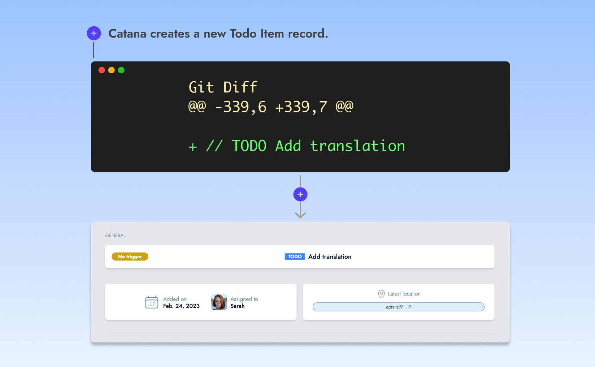
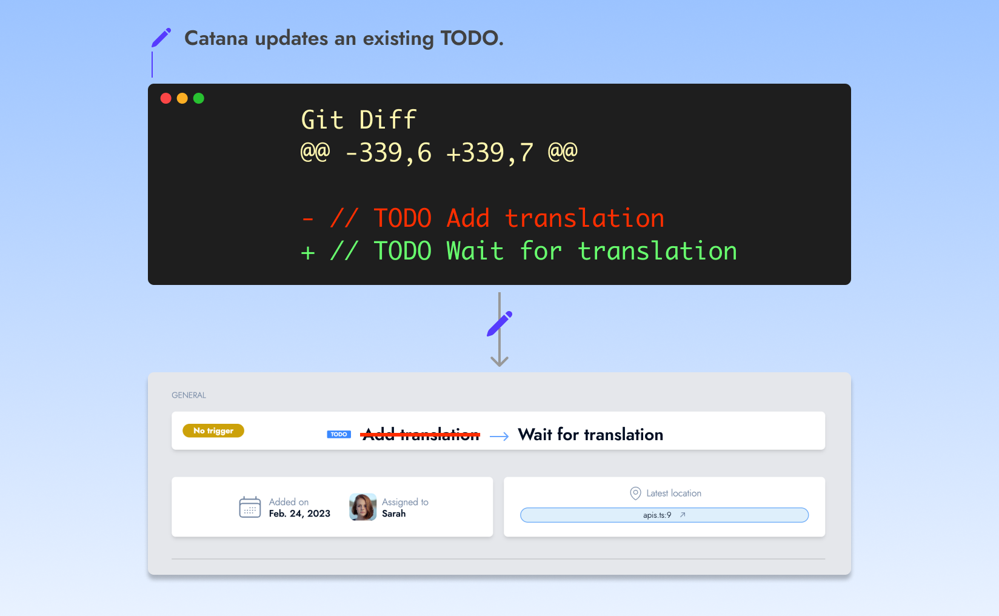

# Create, update and delete


Catana emphasizes keeping your codebase as the source of truth, therefore it doesn't have a UI for creating, updating, or deleting TODOs.


Create, update and delete operations are inferred from Git commits whenever a Git push occurs on the main branch (also known as the release branch) of an enrolled repository.\
\
This page will outline the operation Catana will perform based on what a user changed.

### A TODO is added

Catana creates a new Todo Item record in its database.

<figure><figcaption></figcaption></figure>

### A TODO is removed

Catana destroys the Todo Item record and closes any associated ticket in your issue tracker (in the event where a ticket was created for this TODO).

<figure><figcaption></figcaption></figure>

### A TODO is added and removed

Two different outcome may happen:

#### Update

If the **changes occurs on the same line**, Catana considers that you are trying to update a TODO.

<figure><figcaption></figcaption></figure>

If the changes occurs **on a different line but the TODO itself doesn't change**, Catana considers that the existing TODO is moving location in the file and will update its record accordingly.

<figure><figcaption></figcaption></figure>

#### Destroy and create&#x20;

In all other scenarios from the "Update existing TODO" paragraph, Catana will consider that it needs to destroy and create a new Todo Item record.

<figure><figcaption></figcaption></figure>
