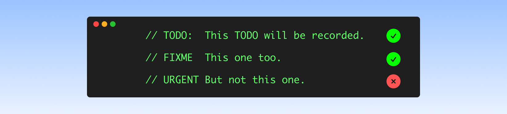
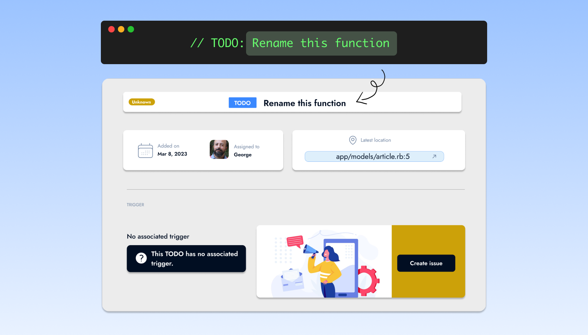
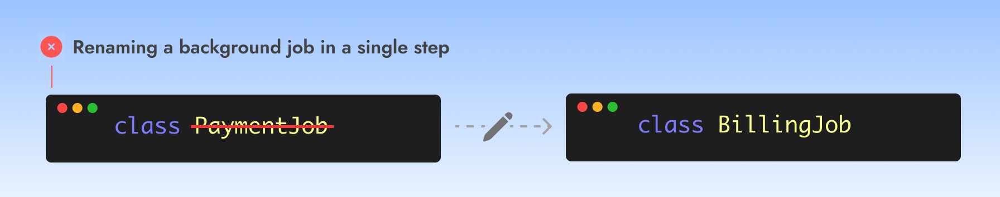
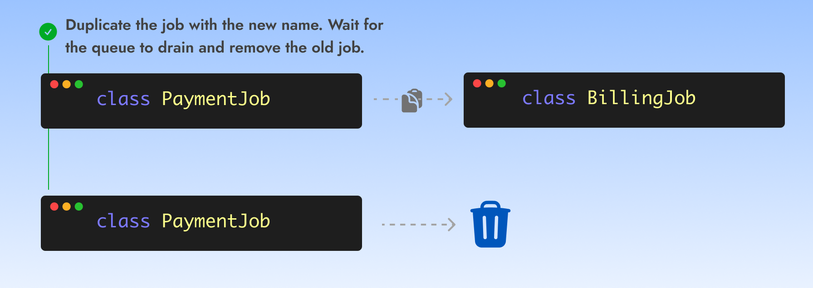
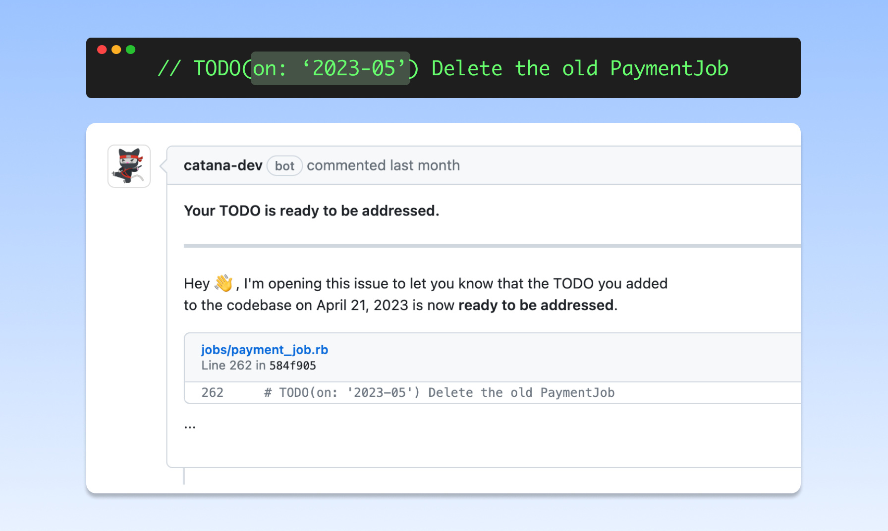

# Regular and expiring TODOs


Catana can process and record all TODOs regardless on the syntax used. It also introduces a new type of TODO that can **expire at the time or condition of your choice**.


### <mark style="color:blue;">Regular TODOs</mark>

Catana processes all changes occurring on the release branch of enrolled repositories in real time. Any annotations using the **conventional keywords in all uppercase letters** (TODO, FIXME, BUG, XXX, NOTE) will be recorded.

<figure><figcaption>
<strong>Examples of annotations Catana will record.</strong>
</figcaption></figure>


Adding a semi-column ":" after the TODO declaration is supported but optional.


**The content that comes after the annotation keyword is treated as the description**. Adding a description is fundamental to helping your team members and future you understand why a TODO was added.

<figure><figcaption>
<strong>The TODO description is reflected on the Catana dashboard.</strong>
</figcaption></figure>

\
Catana will automatically assign authors during the initial TODO recording. Authorship is determined based on the git commit. Authors will be assigned to their TODOs regardless if they ever signed in to Catana.

**Once in a while, users will receive email reminders about their TODOs.**

### <mark style="color:blue;">Expiring TODOs</mark>


The main purpose of expiring TODOs is **helping write temporary chunks of code.**


When introduced in a codebase, a TODO should never be a priority. If it were, using a TODO would not be appropriate. However, it may become a priority at a later point.\
\
Software engineers frequently have to work on tasks requiring a multi-step process.\
For instance, modifying or renaming a background job. The changes needs to be backward compatible until the queue is drained from the previous job's version.&#x20;

<figure><figcaption>
<strong>Renaming a job in a single step will create an outage.</strong>
</figcaption></figure>

<figure><figcaption>
<strong>User has to remember to remove the old job.</strong>
</figcaption></figure>

When a **TODO expires it effectively becomes an actionable issue**. Therefore, instead of sending an email reminder, **Catana opens a ticket in your project management tracker.** This allows its  author and team members to prioritise and address the issue as they see fit.

<figure><figcaption>
<strong>Using an expiring TODO helps surface it when it expires.</strong>
</figcaption></figure>

Expiring a TODO doesn't have to be at a specific date in the future. Whether you need to address a TODO when a related bug is fixed or when a dependency you rely on gets upgraded, **Catana offers various triggers to help you surface and prioritize tasks** at the right moment.

