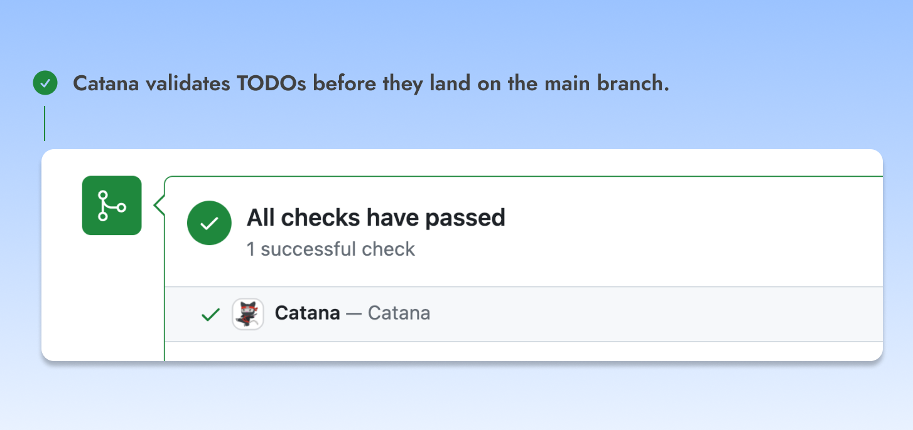
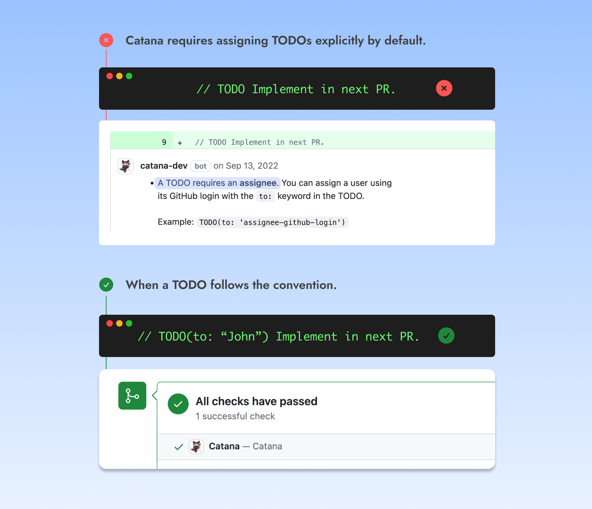
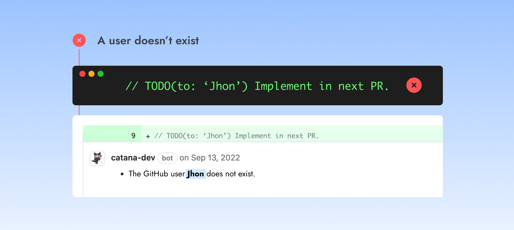

# Validation

<figure><figcaption></figcaption></figure>

Catana has a feature to **validate TODOs before they land on the release branch** of an enrolled repository. This validation serves two purposes.

1. Keep TODOs across your codebase consistent.
2. Prevent errors.


Catana's validation will kick in automatically once a Pull Request **not** in [draft mode](https://github.blog/2019-02-14-introducing-draft-pull-requests/) is opened.


### <mark style="color:blue;">Consistency</mark>

In the same fashion as linters, which help keep code style consistent in your project, **maintaining consistency in your TODOs through a set of conventions helps in managing them more easily**, particularly if you don't use Catana!

An example of such a convention is Catana's default behavior for explicitly assigning users. Team members can quickly identify and direct their questions to TODO authors or assignees without leaving the code editor or going through a `git blame` dance. It also promotes a better sense of accountability.

<figure><figcaption></figcaption></figure>

### <mark style="color:blue;">Errors</mark>

Mistakes happen, and Catana is here to warn developers before merging a Pull Request. For instance, **Catana will provide feedback** in the event where a developer assigns a TODO to a user that doesn't exist or is not a team member.

<figure><figcaption></figcaption></figure>

We all know that overly strict validation can be frustrating (ever had your first name fail validation on a form?), and Catana aims to be as unobtrusive as possible while preventing developers from shooting themselves in the foot.\

