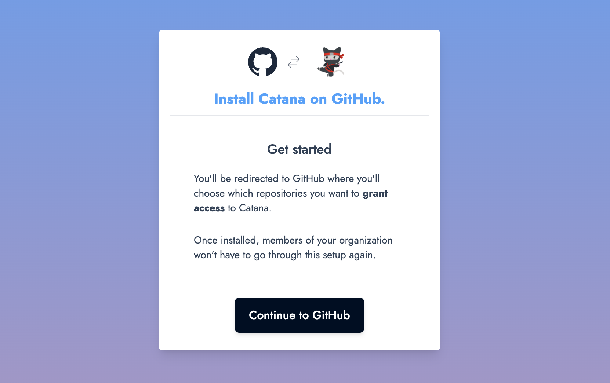
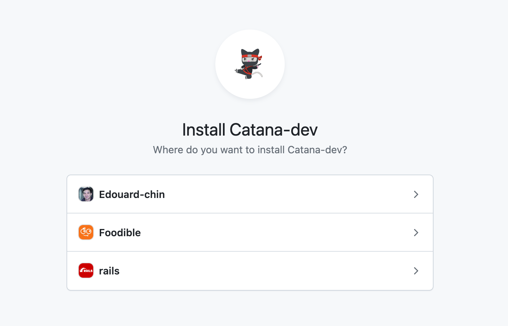
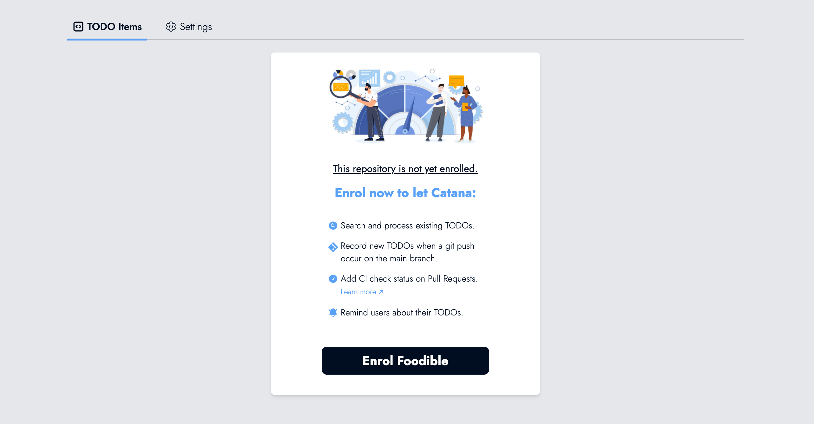

# Installation


Catana can only be installed on GitHub repositories at the moment.


### <mark style="color:blue;">Installing the Catana's GitHub application</mark>

The first time you sign in to Catana, you will be prompted to install the application and will be redirected to GitHub.&#x20;

<figure><figcaption>
<strong>Install the GitHub application.</strong>
</figcaption></figure>

\
Choose the account on which you would like to proceed with the installation, and click "Install".  Congratulations, you have successfully installed Catana! 🥳

<figure><figcaption>
<strong>Choose the organization where you would like to install Catana.</strong>
</figcaption></figure>

**Once Catana is installed, other members of your organization will not be prompted to follow this step.**

### <mark style="color:blue;">Enrol repositories</mark>


Manually enrolling a repository allows each team and project to decide whether they'd like to opt-in.


After installing the GitHub application, you'll be redirected back to Catana where you'll choose\
which repositories you'd like to enrol. You can choose as many repositories as you want!

Enrolling a repository enables the following functionalities:

* 🔍   Let Catana **search and process existing TODOs.**
* **💾    Record upcoming TODOs** whenever a git push occurs on the release branch (usually `main` or `master`).
* ✅   **Add a failing or successful CI check** **status** on Pull Requests introducing a TODO.

<figure><figcaption>
<strong>Enrol your repository and discover Catana!</strong>
</figcaption></figure>

This operation can take a few minutes based on how large the repository is and the number of TODOs found.

