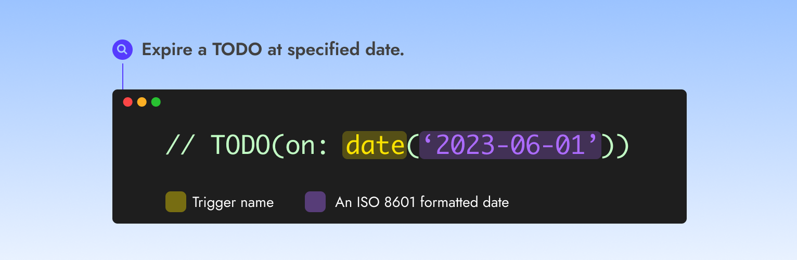

# Date


Use the date trigger to **expire a TODO at a specified date**.


<figure><figcaption></figcaption></figure>

### Usage

➡️ **`TODO(on:`**<mark style="color:yellow;background-color:yellow;">**`date`**</mark>**`(`**<mark style="color:purple;background-color:purple;">**`'2023-06-01'`**</mark>**`))`**

### Short form

The date trigger is the most commonly used one and **has a short form**.

➡️ **`TODO(on:`**<mark style="color:purple;background-color:purple;">**`'2023-06-01'`**</mark>**`)`**

### Examples

<em>Expire a TODO on June 1st, 2023</em>

➡️ **`TODO(on:`**<mark style="color:purple;background-color:purple;">**`'2023-06-01'`**</mark>**`)`**&#x20;

<em>Expire a TODO on August 23rd, 2023 at 10AM</em>

➡️ **`TODO(on:`**<mark style="color:purple;background-color:purple;">**`'2023-08-23 10:00'`**</mark>**`)`**&#x20;

