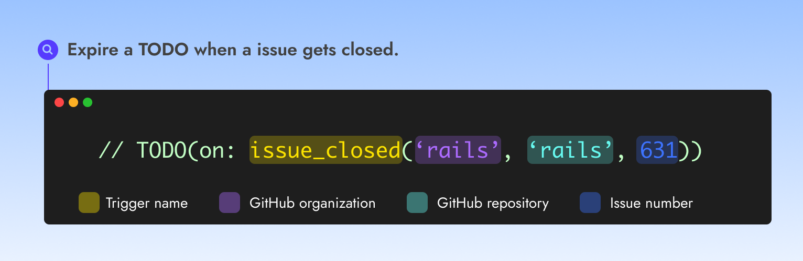

# GitHub Issue closed


Use the GitHub issue closed trigger to expire a TODO when a **GitHub issue is closed.**


<figure><figcaption></figcaption></figure>

### Usage with a syntax

➡️ **`TODO(on:`**<mark style="color:yellow;background-color:yellow;">**`issue_closed`**</mark>**`(`**<mark style="color:purple;background-color:purple;">**`'rails', 'rails', 631`**</mark>**`))`**

### **Authorization**

This trigger can be used to monitor issues on any **public repositories or private repositories belonging to the same organization the TODO is introduced.**

#### Examples

<em>Expire a TODO when the issue #631 from the Rails repository is closed</em>

➡️ **`TODO(on:`**<mark style="color:yellow;background-color:yellow;">**`issue_closed`**</mark>**`(`**<mark style="color:purple;background-color:purple;">**`'rails', 'rails', 631`**</mark>**`))`**

### Usage when detected automatically

When the repository or organisation is not specified, Catana will assume you are referring to an issue in the current repository.

#### Examples

<mark style="color:blue;">TODO</mark>:  **Reuse the calendar component once we fix #754**\
<mark style="color:orange;">Equivalent to</mark>: <mark style="color:yellow;background-color:yellow;">**`issue_closed`**</mark>**`(`**<mark style="color:purple;background-color:purple;">**`'org', 'repo', 754`**</mark>**`)`**

<mark style="color:blue;">TODO</mark>:  **Awaiting for kubernetes/k8s.io#7314**\
<mark style="color:orange;">Equivalent to</mark>:  <mark style="color:yellow;background-color:yellow;">**`issue_closed`**</mark>**`(`**<mark style="color:purple;background-color:purple;">**`'kubernetes', 'k8s.io', 7314`**</mark>**`)`**

<mark style="color:blue;">TODO</mark>:  **Do something if https://github.com/github-linguist/linguist/pulls/344 is resolved**\
<mark style="color:orange;">Equivalent to</mark>:  <mark style="color:yellow;background-color:yellow;">**`issue_closed`**</mark>**`(`**<mark style="color:purple;background-color:purple;">**`'github-linguist', 'linguist', 344`**</mark>**`)`**
