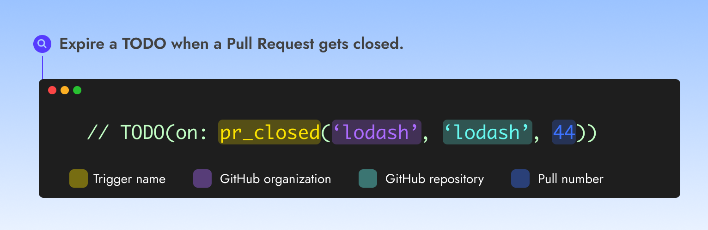

# GitHub Pull Request closed


Use the GitHub Pull Request closed trigger to expire a TODO when a **GitHub Pull Request is closed.**


<figure><figcaption></figcaption></figure>

### Usage

➡️ **`TODO(on:`**<mark style="color:yellow;background-color:yellow;">**`pr_closed`**</mark>**`(`**<mark style="color:purple;background-color:purple;">**`'lodash', 'lodash', 44`**</mark>**`))`**

### **Authorization**

This trigger can be used to monitor pull requests on any **public repositories or private repositories belonging to the same organization the TODO is introduced.**

### Examples

<em>Expire a TODO when the Pull Request #44 from the lodash repository is closed</em>

➡️ **`TODO(on:`**<mark style="color:yellow;background-color:yellow;">**`pr_closed`**</mark>**`(`**<mark style="color:purple;background-color:purple;">**`'lodash', 'lodash', 44`**</mark>**`))`**

