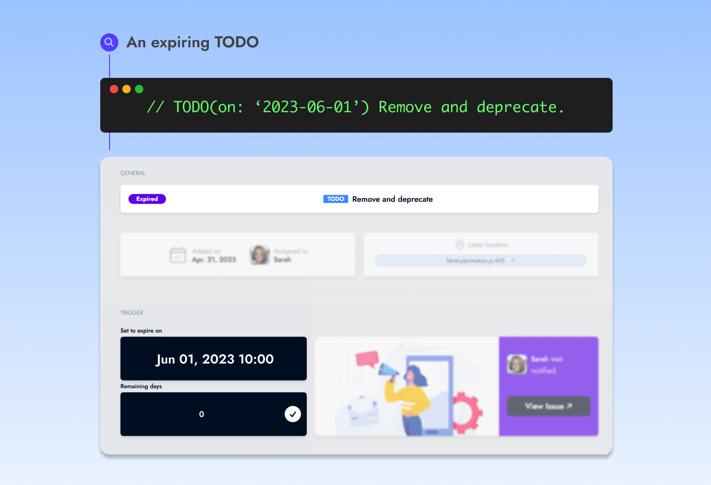
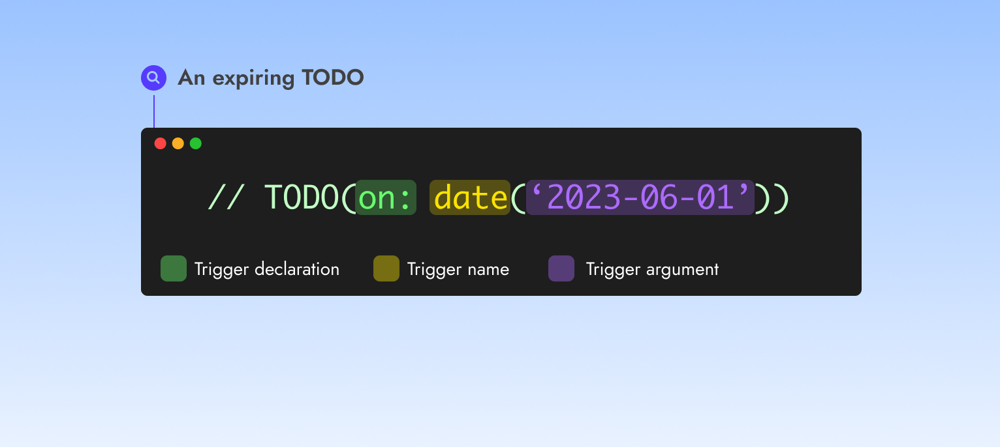

# Overview

<figure><figcaption></figcaption></figure>

Catana provides a powerful feature to **expire your TODO at the time or condition of your choice by using triggers.** A trigger is a simple function that you write on a TODO.

Catana periodically checks the trigger and expires the TODO when the condition is met.


The [Core concept](../core-concepts/regular-and-expiring-todos.md) page has a detailed explanation on expiring TODOs.


### Usage

Triggers are declarable using the <mark style="color:green;">**`on`**</mark> keyword followed by the trigger name. For instance:

### ➡️ TODO(<mark style="color:green;background-color:green;">**on**</mark>: <mark style="color:yellow;background-color:yellow;">**date**</mark>(<mark style="color:purple;background-color:purple;">**'2023-06-01'**</mark>))

<figure><figcaption></figcaption></figure>

