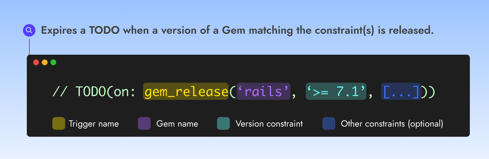

# Ruby Gem released


Use the Ruby Gem released trigger to expire a TODO **when a version of a Gem matching the constraint(s) is released**.


<figure><figcaption></figcaption></figure>

### Usage

➡️ **`TODO(on:`**<mark style="color:yellow;background-color:yellow;">**`gem_release`**</mark>**`(`**<mark style="color:purple;background-color:purple;">**`'nokogiri', '> 1.15'`**</mark>**`))`**

### Examples

Expire a TODO when the Nokogori Ruby gem is released with a version '<code>> 1.15'</code>

➡️ **`TODO(on:`**<mark style="color:yellow;background-color:yellow;">**`gem_release`**</mark>**`(`**<mark style="color:purple;background-color:purple;">**`'nokogiri', '> 1.15'`**</mark>**`))`**

Expire a TODO when the Rails Ruby gem version 7.1 is released

➡️ **`TODO(on:`**<mark style="color:yellow;background-color:yellow;">**`gem_release`**</mark>**`(`**<mark style="color:purple;background-color:purple;">**`'nokogiri', '7.1'`**</mark>**`))`**

Expire a TODO when the Devise Ruby gem is released with a version '<code>> 4.9.2'</code> and <code>'&#x3C; 5'</code>

➡️ **`TODO(on:`**<mark style="color:yellow;background-color:yellow;">**`gem_release`**</mark>**`(`**<mark style="color:purple;background-color:purple;">**`'devise', '> 4.9.2', '< 5'`**</mark>**`))`**

