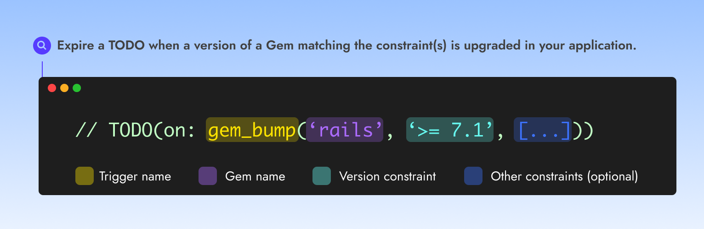

# Ruby Gem upgraded


Use the Ruby Gem upgraded trigger to expire a TODO **when a version of a Gem matching the constraint(s) is upgraded in your application**.


<figure><figcaption></figcaption></figure>

### Usage with a syntax

➡️ **`TODO(on:`**<mark style="color:yellow;background-color:yellow;">**`gem_bump`**</mark>**`(`**<mark style="color:purple;background-color:purple;">**`'nokogiri', '> 1.15'`**</mark>**`))`**

#### Examples

Expire a TODO when  Nokogori is upgraded in your application with a version '<code>> 1.15'</code>

➡️ **`TODO(on:`**<mark style="color:yellow;background-color:yellow;">**`gem_bump`**</mark>**`(`**<mark style="color:purple;background-color:purple;">**`'nokogiri', '> 1.15'`**</mark>**`))`**

Expire a TODO when Rails is upgraded in your application to version 7.1

➡️ **`TODO(on:`**<mark style="color:yellow;background-color:yellow;">**`gem_bump`**</mark>**`(`**<mark style="color:purple;background-color:purple;">**`'nokogiri', '7.1'`**</mark>**`))`**

Expire a TODO when Devise is upgraded in your application with a version '<code>> 4.9.2'</code> and <code>'&#x3C; 5'</code>

➡️ **`TODO(on:`**<mark style="color:yellow;background-color:yellow;">**`gem_bump`**</mark>**`(`**<mark style="color:purple;background-color:purple;">**`'devise', '> 4.9.2', '< 5'`**</mark>**`))`**

### Usage when detected automatically

Please ensure you always explicitly mention the term "gem" (literally), for Catana to correctly detect this trigger.

#### Examples

<mark style="color:blue;">TODO</mark>:  **Remove this monkeypatch once we bump the stripe gem to > 5**\
<mark style="color:orange;">Equivalent to</mark>: <mark style="color:yellow;background-color:yellow;">**`gem_release`**</mark>**`(`**<mark style="color:purple;background-color:purple;">**`'stripe', '> 5'`**</mark>**`)`**

<mark style="color:blue;">TODO</mark>:  w**ebmock 3.24 has this feature, no need for it when we upgrade the gem**\
<mark style="color:orange;">Equivalent to</mark>: <mark style="color:yellow;background-color:yellow;">**`gem_release`**</mark>**`(`**<mark style="color:purple;background-color:purple;">**`'webmock', '3.24'`**</mark>**`)`**

<mark style="color:blue;">TODO</mark>:  **Do something when we update kuaz-thermometer to 1.0.0**\
<mark style="color:orange;">Equivalent to</mark>:  _No detection as the term "gem" is not mentioned_
