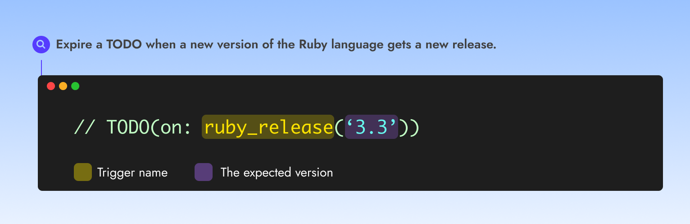

# Ruby Version released


Use the Ruby released trigger to expire a TODO **when a new version of the Ruby language gets a new release.**


<figure><figcaption></figcaption></figure>

### Usage with a syntax

➡️ **`TODO(on:`**<mark style="color:yellow;background-color:yellow;">**`ruby_release`**</mark>**`(`**<mark style="color:purple;background-color:purple;">**`'> 3.2'`**</mark>**`))`**

#### Examples

Expire a TODO when Ruby 3.3.0 is released

➡️ **`TODO(on:`**<mark style="color:yellow;background-color:yellow;">**`ruby_release`**</mark>**`(`**<mark style="color:purple;background-color:purple;">**`'3.3'`**</mark>**`))`**

### Usage when detected automatically

#### Examples

<mark style="color:blue;">TODO</mark>:  **Change our CI matrix when Ruby 3.4 is released**\
<mark style="color:orange;">Equivalent to</mark>: <mark style="color:yellow;background-color:yellow;">**`ruby_release`**</mark>**`(`**<mark style="color:purple;background-color:purple;">**`'3.4'`**</mark>**`)`**
